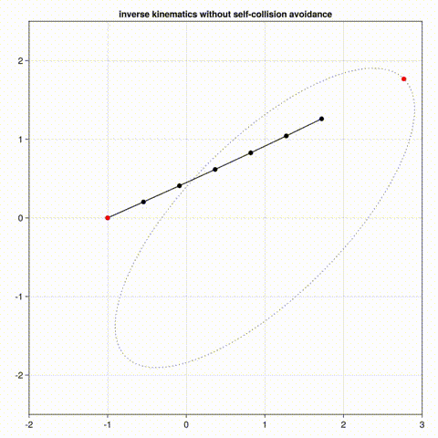
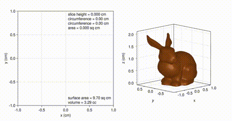
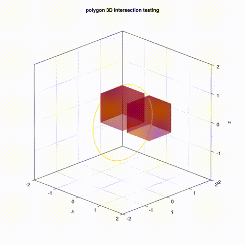

# ripga
# Reference Implementation of Projective Geometric Algebra

>"As long as Algebra and Geometry were separated, their progress was slow and their use limited;
>but once these sciences were united, they lent each other mutual support and advanced rapidly toge
>ther towards perfection. We owe to Descartes the application of Algebra to Geometry; this has become
>the key to the greatest discoveries in all fields of mathematics." - Joseph-Louis Lagrange (1736–1813)

# 0. TLDR
Here's a showcase of animations demonstrating Julia and Projective Geometric Algebra. The intent of this 
essay is to educate, to increase the familiarity with PGA so that more people are able to create transformative
designs solving intricate problems with geometry. The source code of the animations and the PGA library is in
the github repository at https://github.com/sepesi/ripga

<table>
  <tr>
    <td></td>
    <td></td>
  </tr>
  <tr>
    <td><b>Figure 0.1. inverse kinematics animation</b></td>
    <td><b>Figure 0.2. 3D object slicing animation</b></td>
  </tr>
  <tr>
    <td>Based upon Steven De Keninck's inverse kinematics example application in JavaScript and ported to Julia and Makie.</td>
    <td>Based upon Steven De Keninck's pga3d_slicing example application in JavaScript and ported to Julia and Makie.</td>
  </tr>
  <tr>
    <td></td>
    <td></td>
  </tr>
  <tr>
    <td><b>Figure 0.3. Separating Axis Theorem (SAT) animatio</b></td>
    <td><b>Figure 0.4. origami animation</b></td>
  </tr>
  <tr>
    <td>3D version of Separating Axis Theorem (SAT) implemented in Julia and Makie.</td>
    <td>Based upon Steven De Keninck's oeigami example application in JavaScript and ported to Julia and Makie.</td>
  </tr>
</table>

# 1. Why Projective Geometric Algebra?
There are a few compelling reasons for using Projective Geometric Algebra instead of linear algebra:
* PGA unifies many concepts and therefore makes them easier to implement,
* PGA uses geometric objects (e.g., points, lines, planes) that hide the coordinates and are easier to
  mentally manipulate than matrices of coordinates, and
* PGA belongs to the family of [Cayley-Klein](https://en.wikipedia.org/wiki/Cayley%E2%80%93Klein_metric)
  geometries, unifying Euclidean geometry, elliptic geometry, and hyperbolic geometry.

## 1.1 Unify Concepts
Projective Geometric Algebra is good at unifying concepts. For example, in Projective Geometric Algebra
* translation and rotation are the same thing,
* force and torque are the same thing, and
* Maxwell's four equations can be written as one equation.

More concise implementations in software result in faster development, fewer bugs, and less technical debt. 
For example, this video shows Dr. Todd Ell, senior technical fellow at Collins Aerospace (with 68,000 
employees, the world's largest supplier of aerospace components) describing how he is pushing to convert 
the highly regulated Collins Aerospace design and development tool chain currently based upon linear 
algebra to being based instead upon Projective Geometric Algebra.

## 1.2 Hide Coordinates
In geometric algebra, the coordinates are embedded in geometric objects. That abstraction can be very helpful 
when dealing with complex geometry problems.

## 1.3 Unify Geometries
The metric signature (i.e., $\mathbb{R}\_{positive,negative,zero}$, where the three subscripts denote how many
basis vectors square to +1, -1, and 0, respectively) denotes the geometry's dimensions and spatial curvature.
For example, the metric signatures $\mathbb{R}\_{2,0,1}$ and $\mathbb{R}\_{3,0,1}$ enable the Projective Geometric
Algebra to solve many 2D and 3D Euclidean geometry problems. However, switching the signature to
$\mathbb{R}\_{4,0,0}$ enables elliptic geometry capabililties and $\mathbb{R}\_{3,1,0}$ enables hyperbolic
geometry capabilities.

# 2. Why Julia?
There are several compelling reasons for using Julia to implement Projective Geometric Algebra applications:
* easy access to all PGA vector operations,
* metaprogramming capabilities,
* program execution speed,
* plotting capabilities,
* REPL (Read Execute Print Loop), and
* developer community.

## 2.1 Easy Access to All PGA Vector Operations
Although bivector.net lists reference implementations of PGA in several programming languages (e.g., JavaScript, 
C++, C#, Python, Rust), it does not currently list a Julia reference implementation. Julia is also obviously 
missing from the book Geometric Algebra for Computer Science given that the Julia language was created two years 
after the book's publication. So, I ported bivector.net's C++ reference implementation of PGA to Julia in the github 
public repository at https://github.com/sepesi/ripga

To avoid an unnecessary operator translation, the Julia port of ripga uses exactly the same vector operator symbols 
as the vector operators in the programming syntax of the original bivector.net reference implementation as shown in 
the table below.

A slide from Steven De Keninck's presentation to SIGBRAPI, showing the differences between the "standard" math syntax 
and the "standard" programming syntax when writing geometric algebra expressions.

It should be noted that several people in the Julia community strongly disagree with my approach to overloading the 
vector operators. They refer to my approach as "type piracy" and they would prefer that I instead overload custom 
types instead of base types because my approach of overloading base types violates the "avoid type piracy" rule in 
Julia's style guide. Their concerns are that my "type piracy" might
* crash Julia,
* introduce incompatibilities that are hard to predict and diagnose,
* change the behavior of unrelated code unexpectedly, and
* make code not very readable.

However, I've been using ripga and its "type piracy" for several years and have not experienced any of their 
"type piracy" concerns. (If someone dislikes my "type piracy" enough to fork the ripga repository at 
https://github.com/sepesi/ripga and fix my "type piracy" by defining some custom types, I'd love to see it 
and compare the two approaches.) The "type piracy" label seems like an exaggeration to me because "piracy" 
implies stealing but my overloading of base types occurs only when the arguments are vectors and that doesn't 
even compile without the overload. So, given that the vector operations are currently unused, perhaps a better 
name for my violation of Julia's style guide is "type squatting"??

## 2.2 Metaprogramming Capabilities
Julia's extensive metaprogramming capabilities offer a convenient bridge from PGA "math syntax" to PGA "programming 
syntax". Referring again to the above slide from bivector.net, the geometric product operator in math syntax is 
'\thinspace' which takes less space and ink than '*', the geometric product operator in programming syntax. Similarly,
* the wedge operator (outer product) in math syntax is '\wedge',
* the vee operator (regressive product) in math syntax is '\vee',
* the dot operator (inner product) in math syntax is '\cdot', and
* the dual operator in math syntax is '\ast'.

The string macro called ga (for geometric algebra and located in ripgand.jl) translates the math syntax back to the 
programming syntax. For example, the ga macro translates the Unicode '\thinspace' character (i.e., U+02009) representing 
the geometric product operator in math syntax to '*' that represents the geometric product operator in programming syntax.

Typically, I use the programming syntax because it is easier to type. However, the math syntax is easier to read. 
Therefore, for a section of code with a lot of PGA vector operators that are hard to read, the ga macro might be helpful.

## 2.3 Program Execution Speed
As mentioned in the abstract to Julia: A Fresh Approach to Numerical Computing, the authors (i.e., four people who 
started the Julia programming language) mention a long standing belief among many practitioners of numerical computing: 
one must prototype in one language and then rewrite in another language for speed or deployment. One of their design 
goals for Julia was to solve this two-language problem by making Julia both good for prototyping and also fast for deployment.

## 2.4 Plotting Capabilities
According to the Makie documentation,
> "Makie is a data visualization ecosystem for the Julia programming language, with high performance and extensibility.
> It is available for Windows, Mac and Linux."

The Makie backend package with interactive plotting capabilities is GLMakie which is based upon OpenGL and is 
surprisingly fast.

## 2.5 REPL (Read Execute Print Loop)
In the tools section of bivector.net, there is a PGA expression evaluator that enables the exploration of PGA expressions 
without writing a program. Julia's REPL does that and more: in addition to evaluating PGA expressions, Julia's REPL (after 
including ripgand.jl, ripga1d.jl, ripga2d.jl, ripga3d.jl, and ripga4d.jl) can assign PGA expressions to variables and can 
plot PGA expressions, both very helpful when learning or troubleshooting PGA expressions.

REPL is particularly helpful when soliciting help from the Julia community. A common phrase throughout Julia's discourse 
community is MWE (i.e., Minimal Working Example). Even though programmers often work on lengthy Julia programs, requests 
for help from the Julia community programmers are restricted to tiny snippets of code so that the problem can easily be 
replicated by everyone in their own REPL. This is an extremely useful programming practice because the solution often 
reveals itself as I write the MWE to ask the community for help.

## 2.6 Developer Community
In the conclusion of Julia: A Fresh Approach to Numerical Computing, the authors wrote
> "We built Julia to meet our needs for numerical computing, and it turns out that many others wanted exactly the same thing. 
> At the time of writing, not a day goes by when we don't learn that someone new has picked up Julia at universities and
> companies around the world, in fields as diverse as engineering, mathematics, physical and social sciences, finance, biotech,
> and many others. More than just a language, Julia has become a place for programmers, physical scientists, social scientists,
> computational scientists, mathematicians, and others to pool their collective knowledge in the form of online discussions and code."

The significant overlap of the many fields interested in Julia and the many fields interested in geometric algebras (e.g., Projective 
Geometric Algebra, spacetime geometric algebra, conformal geometric algebra) suggests that the Julia community and the Projective
Geometric Algebra community would benefit from each other.

# 3. Getting the Hang of PGA
The phrase "three-view orthographic projection" is from the field of mechanical drawing and it is the standard approach to drawing 
a 3D object on a 2D surface showing three mutually perpendicular perspectives. I think there is an analogous multiple perspective 
approach to defining PGA so it can be fully appreciated. Specifically, the following perspectives (preferably done in the listed 
order) are helpful in getting the hang of PGA:
1. Read a thorough description of the history of the major contributions to PGA by individual mathematicians. The history reveal
   the impressive math lineage behind today's PGA, which builds confidence in the underlying concepts. I particularly like Slehar's
   historical description of Clifford algebra at https://slehar.wordpress.com/2014/03/18/clifford-algebra-a-visual-introduction/
   followed by Slehar's explanation of how Clifford algebra extends to Projective Geometry at
   https://slehar.wordpress.com/2014/06/26/geometric-algebra-projective-geometry/
2. Review the PGA 2D and the PGA 3D cheat sheets by Charles Gunn and Steven De Keninck at https://bivector.net/2DPGA.pdf and
   https://bivector.net/3DPGA.pdf, respectively.
3. Watch a series of PGA video tutorials. These tutorials are generally information dense and probably should be watched
   more than once. They give the motivation to keep learning. I particularly like the PGA tutorial given by Charles Gunn and
   Steven De Keninck during the SIGGRAPH2019 conference at https://www.youtube.com/watch?v=tX4H_ctggYo. However, there are a
   lot of other very good PGA video tutorials at https://bivector.net/doc.html.
4. Read a variety of papers and essays to fill in the gaps in whatever you need to know to implement your own PGA applications.
   For example, if you are interested in using PGA to simulate the physics of interacting objects, read the Leo Dorst and Steven
   De Keninck essay May the Forque Be with You - Dynamics in PGA at https://bivector.net/PGAdyn.pdf. Or if you are interested in
   using Julia's REPL to examine the details of some of the PGA2D and PGA3D cheat sheet formulas, continue reading this essay.

# 4. PGA Basis Multivectors
PGA in a two dimensional Euclidean space requires a basis of eight hypercomplex numbers which can be initialized by including the 
following two files:
* the filename ripga2d.jl is an acronym for Reference Implementation of Projective Geometric Algebra in 2 Dimensions, and
* the filename ripgand.jl is an acronym for Reference Implementation of Projective Geometric Algebra in n Dimensions.

The notation of the basis is simple, where eij is short for eiej (i.e., the multiplication of ei and ej), where eijk is short for 
eiejek (i.e., the multiplication of ei, ej, and ek), where eij = -eji, where e1e1 = e2e2 = 1, and e0e0 = 0 (i.e., the degenerate case).

```
julia> include("ripgand.jl")
julia> include("ripga2d.jl")
julia> basis
8-element Vector{String}:
 "1"
 "e0"
 "e1"
 "e2"
 "e01"
 "e20"
 "e12"
 "e012"
```

As mentioned in this essay's introduction, a compelling reason for using projective geometric algebra is the unification of 
the translation and rotation operations. However, that desired unification comes at the expense of an unintuitive geometric 
interpretation of the basis, where
* e0 is interpreted as a line at infinity,
* e1 and e2 are lines along the y axis and x axis, respectively (which can initially seem like a mislabeling), and
* the bivectors e01, e20, and e12 are interpreted as points (i.e., the meet of two lines). Points that are generated by the
  meeting of two lines, one of which is e0, are called ideal points and they are located at the intersection of parallel lines.

The order of this basis can be reversed, where element i becomes element 9-i. This reverse ordering of the basis results in a 
type of symmetry called the dual and it swaps the roles of points and lines. For example, the third element of the basis is e1, 
which is the line at x=0, but the third element of reverse(basis) is e20 is a point and is called the dual of e1 (i.e., the dual 
of basis[3] is reverse(basis[3]). In practice, duality is a gift of time because every derived PGA equation automatically offers 
a dual form of that PGA equation without any derivation necessary. Similarly, PGA software can be significantly reduced in size 
because the dual of an implemented PGA function is automatically available without any software implementation necessary.

```
julia> reverse(basis)
8-element Vector{String}:
 "e012"
 "e12"
 "e20"
 "e01"
 "e2"
 "e1"
 "e0"
 "1"
```

Similar to PGA in two dimensional Euclidean space, PGA in a three dimensional Euclidean space requires a basis of 16 hypercomplex 
numbers which can be initialized by including two files: ripgand.jl and ripga3d.jl. As before, the notation of the basis is simple, 
where e0123 is short for e0e1e2e3 (i.e., the multiplication of e0, e1, e2, and e3), where eij = -eji, where e1e1 = e2e2 = e3e3 = 1, 
and e0e0 = 0 (i.e., the degenerate case).

```
julia> include("ripgand.jl")
julia> include("ripga3d.jl")
julia> basis
16-element Vector{String}:
 "1"
 "e0"
 "e1"
 "e2"
 "e3"
 "e01"
 "e02"
 "e03"
 "e12"
 "e31"
 "e23"
 "e021"
 "e013"
 "e032"
 "e123"
 "e0123"
```

Again, the desired unification of the translation and rotation operation comes at the expense of an unintuitive geometric 
interpretation of the basis, where
* e0 is interpreted as the plane at infinity,
* e1, e2, and e3 are planes at x=0, y=0, and z=0 respectively,
* the bivectors e01, e02, e03, e12, e31, and e23 are interpreted as lines (i.e., the meet of two planes), and the lines
  that are generated by the meeting of two planes, one of which is e0, are called ideal lines and they are located at the
  intersection of parallel planes, and
* the trivectors e021, e013, e032, and e123 are interpreted as points (i.e., the meet of three planes).

As an aside, interpreting the vectors e0, e1, e2, and e3 as planes is such a key insight that many people would prefer that 
the acronym PGA stand for "Plane-based Geometric Algebra" instead of "Projective Geometric Algebra".

Again, the order of the basis can be reversed, where element i becomes element 17-i. This reverse ordering of the basis again 
results in a type of symmetry called the dual and, in the three dimension case, it swaps the roles of planes and points. For 
example, the third element of the basis is e1, which is the x=0 plane, but the third element of reverse(basis) is e032 is a 
point and it is called the dual of e1 (i.e., the dual of basis[3] is reverse(basis)[3]).

```
julia> reverse(basis)
16-element Vector{String}:
 "e0123"
 "e123"
 "e032"
 "e013"
 "e021"
 "e23"
 "e31"
 "e12"
 "e03"
 "e02"
 "e01"
 "e3"
 "e2"
 "e1"
 "e0"
 "1"
```

In general, PGA in an nD dimensional space requires a basis of 2ᵐ hypercomplex numbers, where m = nD + 1. In general, the 
interpretation of the basis starts with vectors being interpreted as (nD-1)-dimensional subspaces (e.g., 1D lines for nD = 2, 
or 2D planes for nD = 3) and decrements that subspace dimension with the multiplication of each additional vector.

# 5. PGA Exponentials
At the risk of being too ee-sy (pun intended), the letter e is used in several ways:
* the name of the exponential function is e (e.g., e(10,X)),
* the first letter of each of the names of the hypercomplex vectors in the basis is e (e.g., e12), and
* the floating point format of numbers specified in scientific notation uses the letter e (e.g., 1e10).

An exponential function can demonstrate PGA's unification of translation and rotation.

(TODO)

$$
\mathbf{T} = \underbrace{ e^{\frac{\theta_1}{2}\mathbf{e}_{12}} e^{\frac{r_1}{2}\mathbf{e}_{01}} }_{\text{Circle 2}} \underbrace{ e^{\frac{\theta_2}{2}\mathbf{e}_{31}} e^{\frac{r_2}{2}\mathbf{e}_{03}} }_{\text{Circle 1}} \underbrace{\mathbf{e}_{123}}_{\text{origin}}
$$
