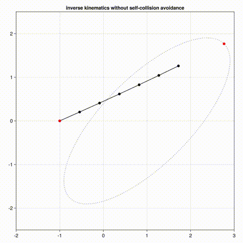
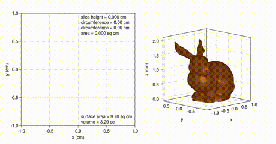
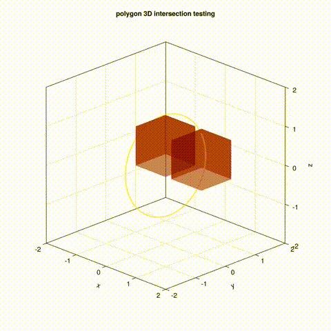
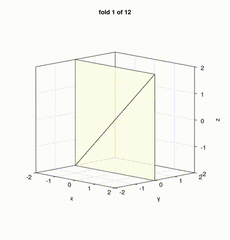

# ripga
# Reference Implementation of Projective Geometric Algebra

>"As long as Algebra and Geometry were separated, their progress was slow and their use limited;
>but once these sciences were united, they lent each other mutual support and advanced rapidly together
>towards perfection. We owe to Descartes the application of Algebra to Geometry; this has become the
>key to the greatest discoveries in all fields of mathematics." - Joseph-Louis Lagrange (1736–1813)

# 0. TLDR
Here's a showcase of animations demonstrating [Julia](https://julialang.org), [Makie](https://docs.makie.org/stable),
and [Projective Geometric Algebra](https://bivector.net) as implemented by ripga (i.e., the Reference Implementation
of Projective Geometric Algebra). The intent of the ripga library and this essay is to educate: to increase the
familiarity with PGA so that more people are able to design solutions to intricate geometry problems. The source
code of the animations and the ripga library, both written in Julia, is in the github repository at
https://github.com/sepesi/ripga

<table>
  <tr>
    <td></td>
    <td></td>
  </tr>
  <tr>
    <td><b>Figure 0.1. <a href="https://enkimute.github.io/ganja.js/examples/coffeeshop.html#pga2d_inverse_kinematics">inverse kinematics</a> animation</b></td>
    <td><b>Figure 0.2. <a href="https://enkimute.github.io/ganja.js/examples/coffeeshop.html#pga3d_slicing">3D object slicing</a> animation</b></td>
  </tr>
  <tr>
    <td>Based upon Steven De Keninck's inverse kinematics example application in JavaScript and ported to Julia and Makie.</td>
    <td>Based upon Steven De Keninck's pga3d_slicing example application in JavaScript and ported to Julia and Makie.</td>
  </tr>
  <tr>
    <td></td>
    <td></td>
  </tr>
  <tr>
    <td><b>Figure 0.3. <a href="https://enkimute.github.io/ganja.js/examples/coffeeshop.html#pga2d_separating_axis">Separating Axis Theorem (SAT)</a> animation</b></td>
    <td><b>Figure 0.4. <a href="https://enkimute.github.io/ganja.js/examples/coffeeshop.html#pga2d_origami">origami</a> animation</b></td>
  </tr>
  <tr>
    <td>3D version of Separating Axis Theorem (SAT) implemented in Julia and Makie.</td>
    <td>Based upon Steven De Keninck's oeigami example application in JavaScript and ported to Julia and Makie.</td>
  </tr>
</table>

# 1. Why Projective Geometric Algebra?
For intricate geometry problems, there are a few compelling reasons for using Projective Geometric Algebra:
* PGA unifies many concepts (e.g., translations and rotations), making them easier to implement,
* PGA has geometric objects (e.g., points, lines, planes), making them easier to mentally manipulate than matrices of coordinates, and
* PGA belongs to the family of [Cayley-Klein](https://en.wikipedia.org/wiki/Cayley%E2%80%93Klein_metric)
  geometries, unifying Euclidean geometry (with applications in computer graphics and simulating the
  dynamic motion of objects), elliptic geometry (with applications in cosmology and cartography),
  and hyperbolic geometry (with applications in spatial indexing data structures and relativistic spacetime
  modeling).

## 1.1 Unify Concepts
Projective Geometric Algebra is good at unifying concepts. For example, in Projective Geometric Algebra
* translation and rotation are the same thing,
* force and torque are the same thing, and
* Maxwell's four equations can be written as one equation.

More concise implementations in software result in faster development, fewer bugs, and less technical debt. 
For example, [this video](https://www.youtube.com/watch?v=_3WPLawT-H0) shows Dr. Todd Ell, senior technical
fellow at Collins Aerospace (with 68,000 employees including 16,700 engineers, the world's largest supplier
of aerospace components) describing how he is pushing to train the highly regulated Collins Aerospace engineers
to use geometric algebra as a design and development tool, in many cases instead of the traditional linear
algebra tools.

## 1.2 Geometric Objects
In Projective Geometric Algebra, the coordinates are embedded in geometric objects, avoiding the difficulties
of entering and debugging matrices of coordinates and transformations. That abstraction is especially helpful
when dealing with complex geometry problems.

## 1.3 Unify Geometries
The metric signature (i.e., $\mathbb{R}\_{positive,negative,zero}$, where the three subscripts denote how many
basis vectors square to +1, -1, and 0, respectively) denotes the geometry's dimensions and spatial curvature.
For example, the metric signatures $\mathbb{R}^\*\_{2,0,1}$ and $\mathbb{R}^\*\_{3,0,1}$ enable the Projective Geometric
Algebra to solve many 2D and 3D Euclidean geometry problems. However, switching the signature to
$\mathbb{R}\_{4,0,0}$ enables elliptic geometry capabililties and $\mathbb{R}\_{3,1,0}$ enables hyperbolic
geometry capabilities.

# 2. Why Julia?
There are several compelling reasons for using Julia to implement Projective Geometric Algebra applications:
* advanced capabilities in vector operations (and vector operations play a central role in PGA),
* metaprogramming capabilities,
* program execution speed,
* plotting capabilities,
* REPL (Read Execute Print Loop), and
* developer community.

## 2.1 Advanced Capabilities in Vector Operations
Although [bivector.net](https://bivector.net) lists reference implementations of PGA in several programming languages
(e.g., JavaScript, C++, C#, Python, Rust), it does not currently list a Julia reference implementation. Also, Julia is
necessarily missing from the book Geometric Algebra for Computer Science given that the Julia language was created two
years after the book's publication. So, I ported bivector.net's C++ reference implementation of PGA to Julia in the
github public repository at https://github.com/sepesi/ripga

To avoid confusion, the Julia port of ripga uses exactly the same [vector operator symbols](https://www.youtube.com/watch?v=2DgxeizE3E8&t=105s)
as the vector operators in the programming syntax of the original bivector.net reference implementation as shown in the table below.

| Math Syntax | Vector Operator Symbol Name | Programming Syntax |
| :--- | :--- | :--- |
| $`ab`$ | Geometric Product | `a * b` |
| $`a \wedge b`$ | Outer Product (Wedge) | `a ^ b` |
| $`a \vee b`$ | Regressive Product (Vee) | `a & b` |
| $`a \cdot b`$ | Inner Product (Dot) | `a` \| `b` |
| $`a\ast`$ | Dual | `a!` |
| $`ab\tilde{a}`$ | Sandwich Product | `a >>> b` |

It should be noted that the general consensus from the Julia community is that my approach to overloading the
vector operators is "type piracy". They suggested that I overload custom types instead of base types in order
to comply with the "avoid type piracy" rule in [Julia's style guide](https://docs.julialang.org/en/v1/manual/style-guide/).
Their concerns are that my approach of overloading base types might
* crash Julia,
* introduce incompatibilities that are hard to predict and diagnose,
* change the behavior of unrelated code unexpectedly, and
* make the code difficult to read.

However, I've been using ripga and its overloading of base types for several years and have not experienced any
of the Julia community's concerns. In my opinion, I think overloading the base types actually makes the code easier
to read. Of course, if someone dislikes my "type piracy" enough to fork the ripga repository and overload custom
types instead of base types, I'd love to see it and compare the two approaches. To me, the community's "type piracy"
label seems like an exaggeration because "piracy" implies stealing but my overloading of base types occurs only
when the arguments are vectors and those vector operations don't even compile without the base type overloading.
So, given that the vector operations are currently unused, perhaps a better name for my particular violation of
Julia's style guide is "type squatting" instead of "type piracy"??

## 2.2 Metaprogramming Capabilities
Julia's extensive metaprogramming capabilities offer a convenient conversion from PGA "math syntax" to "programming 
syntax". For example, referring to the above Vector Operator Symbol table, the geometric product operator in math
syntax [Unicode](https://en.wikipedia.org/wiki/Unicode) is '\thinspace' which takes less space than '*' (the geometric
product operator in programming syntax). Similarly,
* the wedge operator (outer product) in math syntax Unicode is '\wedge',
* the vee operator (regressive product) in math syntax Unicode is '\vee',
* the dot operator (inner product) in math syntax Unicode is '\cdot', and
* the dual operator in math syntax Unicode is '\ast'.

The string macro called ga (short for Geometric Algebra and coded in ripgand.jl) translates the math syntax back to
the programming syntax. For example, the ga macro translates the Unicode '\thinspace' character (i.e., U+02009)
representing the geometric product operator in math syntax to '*' that represents the geometric product operator
in programming syntax. Typically, I prefer the programming syntax because it is easier to type. However, the math
syntax is easier to read. Therefore, for a section of code with a lot of PGA vector operators that are hard to read,
the ga macro can be helpful.

## 2.3 Program Execution Speed
As mentioned in the official _[Introduction to Julia](https://julialang.org): A Fresh Approach to Numerical Computing_,
the authors (i.e., four people who started the Julia programming language) mention a long standing belief among many
practitioners of numerical computing: one must prototype in one language and then rewrite in another language for speed
before deployment. One of their design goals for Julia was to solve this two-language problem by making Julia both good
for prototyping and also fast for deployment.

## 2.4 Plotting Capabilities
According to the official [introduction to Makie](https://docs.makie.org/stable/),
> "Makie is a data visualization ecosystem for the Julia programming language, with high performance and extensibility.
> It is available for Windows, Mac and Linux."

The Makie backend package with interactive plotting capabilities is GLMakie which is based upon OpenGL and is 
surprisingly fast.

## 2.5 REPL (Read Execute Print Loop)
In the tools section of bivector.net, there is a PGA expression evaluator for exploring PGA expressions. After including
the ripga files, Julia's REPL also can explore PGA expressions. In addition to evaluating PGA expressions, Julia's REPL
(after including ripgand.jl and ripga1d.jl, ripga2d.jl, ripga3d.jl, or ripga4d.jl) can do several things that the bivector.net
PGA expression evaluator cannot. Specifically, Julia's REPL can help with learning or troubleshooting PGA expressions by 
* assigning PGA expressions to variables,
* calling functions, and
* displaying inline comments.

## 2.6 Developer Community
In the conclusion of _[Julia: A Fresh Approach to Numerical Computing](https://julialang.org/assets/research/julia-fresh-approach-BEKS.pdf)_,
the authors write
> "We built Julia to meet our needs for numerical computing, and it turns out that many others wanted exactly the same thing. 
> At the time of writing, not a day goes by when we don't learn that someone new has picked up Julia at universities and
> companies around the world, in fields as diverse as engineering, mathematics, physical and social sciences, finance, biotech,
> and many others. More than just a language, Julia has become a place for programmers, physical scientists, social scientists,
> computational scientists, mathematicians, and others to pool their collective knowledge in the form of online discussions and code."

The significant overlap of the many fields interested in Julia and the many fields interested in geometric algebras (e.g., Projective 
Geometric Algebra, spacetime geometric algebra, conformal geometric algebra) suggests that the Julia community and the Projective
Geometric Algebra community would benefit from each other.

# 3. Getting the Hang of PGA
There are three perspectives that contribute to getting the overall hang of PGA:

## 3.1 History
Reading a thorough description of the history of the major contributions by individual mathematicians to PGA reveals the impressive
math lineage behind today's PGA, which builds confidence in the underlying concepts. I particularly like [Slehar's historical description of
Clifford algebra](https://slehar.wordpress.com/2014/03/18/clifford-algebra-a-visual-introduction/) followed by [Slehar's explanation of how
Clifford algebra extends to Projective Geometry](https://slehar.wordpress.com/2014/06/26/geometric-algebra-projective-geometry/).

## 3.2 Nomenclature
In PGA, simple geometric objects (e.g., points, lines, planes) are written as PGA expressions. Those geometric objects are manipulated
(e.g., translated or rotated) by performing PGA operations (e.g., geometric product or outer product) on those PGA expressions.
PGA expressions are the summation of terms, each consisting of a scaled element from the PGA basis. The PGA basis is determined by the
underlying space as specified by the metric signature (i.e., $\mathbb{R}\_{positive,negative,zero}$. The three subscripts of the metric
signature denote the number of basis vectors that square to +1, -1, and 0, respectively. For example, the metric signature for doing PGA
in an n-dimensional [Euclidean space](https://en.wikipedia.org/wiki/Euclidean_space) is $\mathbb{R}^\*\_{n,0,1}$, where n is the number
of Euclidean dimensions (which is also the number of Euclidean basis vectors in the PGA basis) and the 1 in the last of the three subscripts
denotes the single ideal basis vector that squares to 0. That ideal basis vector is also known as the null basis vector e0.

The n Euclidean basis vectors and the one ideal basis vector are said to have grade-1 in the PGA basis because they are generated from a single
PGA basis vector. Similarly, the grade-n elements of the PGA basis are generated from n PGA basis vectors. Grade-2 elements of the PGA basis are
also called bivectors (e.g., e12 = e1e2) and grade-3 elements of the PGA basis are also called trivectors (e.g., e012 = e0e1e2). Because each
element of the PGA basis can be represesnted by a vector, a PGA basis can be thought of as a vector of vectors. However, to avoid ambiguity about
the meaning of "vector", the phrase "PGA basis vector" in this essay will be reserved for just the grade-1 PGA basis elements and the phrases
"PGA basis bivector" and "PGA basis trivector" will be reserved for grade-2 and grade-3 PGA basis elements, respectively. Arbitrary grade PGA
basis elements of an arbitrary grade are just called "PGA basis elements". (More on the PGA basis elements in the next
section of this essay.)

For the metric signature $\mathbb{R}^\*\_{n,0,1}$, there are a total of $2^{n+1}$ PGA basis elements according to the [rule of product](https://wikipedia.org/wiki/Rule_of_product)
covering n+2 grades (i.e., grade-0 through grade n+1), each with $\binom{n+1}{grade}$ PGA basis elements per grade, according to [Pascal's triangle](https://wikipedia.org/wiki/Pascal's_triangle)
from [combinatorics](https://en.wikipedia.org/wiki/Combinatorics).
For example in 3D PGA, there are 16 (i.e., $2^{3+1}$) PGA basis elements: 
* 1 grade-0 (i.e., the scalar),
* 4 grade-1 (i,e., e0, e1, e2, e3),
* 6 grade-2 (i.e., e01, e02, e03, e12, e31, e23),
* 4 grade-3 (i.e., e021, e013, e032, e123), and
* 1 grade-4 (i.e., e0123).

## 3.3 Geometric Interpretation
Recalling that the three subscripts of the metric signature $\mathbb{R}\_{positive,negative,zero}$ specify how many PGA basis vectors square to +1,
-1, and 0, respectively, you may have noticed that the metric signature for PGA in an n-dimensional Euclidean space (i.e., $\mathbb{R}^\*\_{n,0,1}$)
has an asterisk. The asterisk specifies the geometric interpretation of the PGA basis. With the asterisk, the geometric interpretation is "plane-based"
and without the asterisk the geometric interpretation is "point-based". For most people already somewhat familiar with linear algebra, the geometric
interpretation is the most confusing of the three perspectives needed to fully appreciate PGA. Because plane-based PGA offers several advantages (e.g.,
universal rotors) over point-based PGA, plane-based PGA is used much more often than point-based PGA. If the plane-based/point-based qualifier is
missing, it is usually safe to assume the intent was plane-based PGA.

For example in 3D plane-based PGA,
* a grade-1 PGA basis element (e.g., e1) represents a plane,
* a grade-2 PGA basis element (e.g., e12) represents a line, and
* a grade-3 PGA basis element (e.g., e123) represents a point.

In contrast in 3D point-based PGA,
* a grade-1 PGA basis element (e.g., e1) represents a point,
* a grade-2 PGA basis element (e.g., e12) represents a line, and
* a grade-3 PGA basis element (e.g., e123) represents a plane.

(More on the geometric interpretations in the next section.)

# 4. PGA Basis
The ripga library is capable of switching back and forth between the bases for 1D PGA, 2D PGA, 3D PGA, and 4D PGA.

## 4.1 1D PGA Basis
To prepare Julia's REPL for 1D PGA, include the files ripgand.jl and ripga1d.jl. To confirm the initialization, print out the basis.

```
julia> include("ripgand.jl"); # utility functions for all available dimensions

julia> include("ripga1d.jl"); # enable 1D PGA

julia> [basis reverse(basis)]
4×2 Matrix{String}:
 "1"    "e01"
 "e0"   "e1"
 "e1"   "e0"
 "e01"  "1"
```
The 1D PGA basis element names listed in basis specify the 1D PGA basis written in the form of vector of vectors. Note that the REPL
shows vectors of length five instead of four because ripga appends to each PGA basis element a status field (which is currently unused).
```
julia> B = [eu e0 e1 e01] # 1D PGA basis in form of vector of vectors
5×4 Matrix{Float32}:
 1.0  0.0  0.0  0.0
 0.0  1.0  0.0  0.0
 0.0  0.0  1.0  0.0
 0.0  0.0  0.0  1.0
 0.0  0.0  0.0  0.0
```
Calling the PGA basis "B" and calling the PGA basis reversed left to right "BR", B and BR can be used as inputs to geoprodset() to
calculate the needed sign changes in the 1D PGA dual operation (omitting the appended status field in each PGA basis element before
calling geoprodset()).
```
julia> BR = [e01 e1 e0 eu]
5×4 Matrix{Float32}:
 0.0  0.0  0.0  1.0
 0.0  0.0  1.0  0.0
 0.0  1.0  0.0  0.0
 1.0  0.0  0.0  0.0
 0.0  0.0  0.0  0.0

julia> geoprodset(B[1:end-1,:],BR[1:end-1,:])
4×4 Matrix{Float32}:
 0.0  0.0   0.0  0.0
 0.0  0.0   0.0  0.0
 0.0  0.0   0.0  0.0
 1.0  1.0  -1.0  1.0
 ```
According to the [Cartan–Dieudonné theorem](https://en.wikipedia.org/wiki/Cartan%E2%80%93Dieudonn%C3%A9_theorem), every
rigid body transformation is composed of reflections across hyperplanes (i.e., points in 1D, lines in 2D, planes in 3D).
In 1D, translation is composed of reflecting across two points. The following REPL session shows an example of translation
using 1D PGA to specify reflections across two points P1 and P2 where
* P1 is a point at x=1,
* P2 is another point, 5 to the right of P1, and
* the motor composed of those two points separated by a distance of 5 translates a point to the right by 10 (i.e., twice
  the separation distance between the two points).

In 1D PGA, the Euclidean origin is e1 and the equation for the 1D PGA point at x is P = xe0 + e1.

```
julia> P1 = e1 + e0; # Euclidean point x=1 => 1D PGA point eq. (xe0+e1)

julia> P2 = e1 + 6*e0; # Euclidean point x=6 => 1D PGA point eq. (xe0+e1)

julia> T = P2*P1; # compose the two reflection Translation motor as geometric product

julia> toStr(T) # check Translation motor (distance between reflection points is 5)
"1 + 5e01"

julia> P0 = e1; # Euclidean origin (x=0 => 1D PGA point eq. (xe0+e1)

julia> PX = T*P0*~T; # apply Translation motor to P0 at origin; alternative eq is PX = T>>>P0

julia> toStr(PX) # resulting dual PGA point (xe0+e1) => Euclidean point x=10
"10e0 + e1"
```
Taking a closer look, the reason that the translation motor in the above REPL session works is because the sandwich
operation on a 1D PGA object is an [orthogonal transformation](https://en.wikipedia.org/wiki/Orthogonal_transformtion)
(i.e., the squared norm of the 1D PGA object is preserved). Concretely, the squared norm of P0 is e11 = 1, and the
squared norm of T*P0*~T is the squared norm of (1 + 5e01)e1(1 - 5e01), which simplifies to the squared norm of
(e1 + 10e0) = (e1 + 10e0)(e1 + 10e0) = e11 + 10e01 - 10e01 + 100e00 = 1 because e11 = 1 and e00 = 0. In other words,
the squared norm of the 1D PGA point P0 is preserved through the sandwich operation.

In contrast, the translation motor in the above REPL session does not work when the sandwich operation transforms
a **point-based** 1D PGA object instead of a **plane-based** 1D PGA object. In point-based 1D PGA, it is still true
that e00 = 0 and e11 = 1, so the same 1D PGA library (i.e., ripga1d.jl) can do all the PGA vector operations. However,
in point-based 1D PGA, e0 is the Euclidean origin (instead of e1) and the point-based 1D PGA equation for a point at
x is P = e0 + xe1 (instead of P = e1 + xe0), as shown in the following REPL session attempting to calculate the
point-based 1D PGA translation motor.
```
julia> P1 = e0 + e1; # point-based 1D PGA point at x=1

julia> P2 = e0 + 6*e1; # point-based 1D PGA point at x=6

julia> T = P2*P1; # attempt at calculating point-based 1D PGA translation motor

julia> toStr(T)
"6 - 5e01"
```
Recall that the plane-based 1D PGA translation motor was T = 1 + 5e01, which is the exact algebraic form of a 
[dual number](https://en.wikipedia.org/wiki/Dual_number). In contrast, the above REPL session calculates the point-
based 1D PGA translation motor T = 6 - 5e01, which is **not** in the algebraic form of a dual number. That is a red
flag, but let's naively continue and perform the sandwich operation.
```
julia> P0 = e0; # point-based 1D PGA point of Euclidean origin

julia> PX = T*P0*~T; # naive sandwich operation calculating translated point-based 1D PGA point

julia> toStr(PX)
"36e0"
```
That calculated PX is not in the form of a plane-based 1D PGA translated point (i.e., PX = e0 + xe1). Therefore, that
attempt at calculating a point-based 1D PGA translation motor failed. Looking closer for the cause of the failure, the
squared norm of P0 was preserved through the sandwich operation but only in the trivial sense because the squared norm
of P0 collapsed to zero (i.e., e00 = 0) and the squared norm of PX also collapsed to zero (i.e., 36*36e00 = 0).

## 4.2 2D PGA Basis
(TODO)
To prepare Julia's REPL for 2D PGA, include the files ripgand.jl and ripga2d.jl. To confirm the initialization, print out the basis.
Note that the basis is typically sorted by grade, which does not imply an interpretation of the PGA basis because the same basis
can be interpreted as either direct PGA or dual PGA.

```
julia> include("ripgand.jl"); # utility functions for all available dimensions

julia> include("ripga2d.jl"); # enable 2D PGA

julia> [basis reverse(basis)] # col 1 basis in order of grade; col 2 basis in reverse order of grade
8×2 Matrix{String}:
 "1"     "e012"
 "e0"    "e12"
 "e1"    "e20"
 "e2"    "e01"
 "e01"   "e2"
 "e20"   "e1"
 "e12"   "e0"
 "e012"  "1"```
```
According to the [Cartan–Dieudonné theorem](https://en.wikipedia.org/wiki/Cartan%E2%80%93Dieudonn%C3%A9_theorem), every rigid body
transformation is composed of reflections across hyperplanes (i.e., lines in 2D, planes in 3D). In 2D, translation is composed of 
reflecting across two parallel lines, and rotation is composed of reflecting across two intersecting lines. Here is an example of
translation using dual PGA to specify reflections across two parallel lines L1 and L2 where
* L1 is a vertical line, the y-axis,
* L2 is another vertical line, 5 to the right of the y-axis, and
* the motor composed of those two vertical lines separated by a distance of 5 translates a point to the right by 10 (i.e., twice
  the separation distance between the parallel vertical lines).

```
julia> L1 = e1; # the x=0 hyperplane is the y-axis

julia> L2 = e1-5*e0; # Euclidean eq. x-d=0 => dual PGA line eq. (ae1+be2+ce0); see cheat sheet

julia> T = L2*L1; # compose the two reflection Translation motor as geometric product

julia> toStr(T) # check Translation motor
"1 - 5e01"

julia> P = e12; # Euclidean origin => dual PGA point eq (xe20+ye01+e12); see cheat sheet

julia> P2 = T*P*~T; # apply Translation motor to P at origin; alternative eq is P2 = T>>>P

julia> toStr(P2) # resulting dual PGA point (xe20+ye01+e12) => Euclidean point (x,y) = (10,0); see cheat sheet
"10e20 + e12"
```
Similarly, here is an example of rotation using dual PGA to specify reflections across two intersecting lines L1 and L2 where
* L1 is a vertical line, the y-axis,
* L2 is L1 rotated by 45 degrees, and
* the rotor composed of those two intersecting lines rotates any line by 90 degrees (i.e., twice the angle between
  the two intersecting lines composing the rotor).

```
julia> L1 = e1; # the x=0 hyperplane is the y-axis

julia> theta = pi/4; L2 = cos(theta)e1+sin(theta)e2; # L2 is L1 rotated by pi/4 = 45 degrees

julia> R = L2*L1; # generate the rotation motor (also called a Rotor) as geometric product

julia> toStr(R) # check Rotation motor
"0.7071068 - 0.7071068e12"

julia> L1R = R*L1*~R; # apply Rotation motor to rotate line L1

julia> toStr(L1R) # resulting dual PGA line (ae1+be2+ce0) => Euclidean line (ax+by+c=0) => y=0; see cheat sheet
"0.9999999e2"
```
Combining the translation and the rotation operation from the previous two REPL sessions, here is an example of
a general motor composed of a rotation motor followed by a translation motor.

```
julia> toStr(T)
"1 - 5e01"

julia> toStr(R)
"0.7071068 - 0.7071068e12"

julia> M = T*R; # general Motor applying rotation first (order is right to left, like matrix multiply)

julia> toStr(M)
"0.7071068 - 3.535534e01 - 3.535534e20 - 0.7071068e12"

julia> P = e20 + e12; # Euclidean point (x,y) => dual PGA point (xe20+ye01+e12); see cheat sheet

julia> P2 = M*P*~M; # apply general motor to PGA point P

julia> toStr(P2) # resulting dual PGA point (xe20+ye01+e12) => Euclidean point (x,y) = (10,1); see cheat sheet
"e01 + 10e20 + 0.9999999e12"
```

Yet another type of translation motor is generated by the geometric product of two points. For example,
the Euclidean points (x1,y1) and (x2,y2) correspond to 2D dual PGA points P1 = x1e20 + y1e01 + e12 and
P2 = x2e20 + y2e01 + e12, respectively (see 2D PGA cheat sheet). The geometric product of those points is
P2P1 = e12(x1e20 + y1e01) + (x2e20 + y2e01)e12 + e1212, where several terms dropped out because e00 = 0.
Applying the anti-commuting properties of the basis vectors, that geometric product simplifies to 
P2P1 = -x1e01 + y1e20 + x2e01 - y2e20 - 1. After grouping, P2P1 = (x2-x1)e01 - (y2-y1)e20 - 1. After
factoring out a -1 and rearranging, the geometric product of the two points can be written as
P2P1 = -1(1 - E01(x2-x1) + e20(y2-y1)), where the -1 factor can be ignored because the motor always
gets implemented in a sandwich operation and the -1 factor at the beginning of the sandwich cancels
out the -1 factor at the end of the sandwich. Recalling the first REPL session in which the formula for
the translation motor composed of two reflections in parallel planes was T = 1 - de01, where d was the
shortest distance between the two planes and the resulting translation was 2d in the e02 direction, the
same factor of two applies to the point to point translation.

Concretely, the following REPL session translates one tenth of the way from the Euclidean point (-1.5,-1)
to Euclidean point (1.5,-1).

```
julia> P1 = e12 - 1.5*e20 - e01; # 2D dual PGA point for Euclidean point (-1.5,-1); see 2D cheat sheet

julia> P2 = e12 + 1.5*e20 - e01; # 2D dual PGA point for Euclidean point (1.5,-1); see 2D cheat sheet

julia> T = P2*P1; toStr(T) # translation motor with distance between P1 and P2
"-1 + 3e01"

julia> T[5] /= 2; # scale motor distance by 1/2 so that translation distance goes from P1 to P2

julia> T[5] /= 10; # scale translation distance so that translation distance goes 1/10th from P1 to P2

julia> PX = T*P1*~T; # calculate intermediate point between P1 and P2

julia> toStr(PX) # 1st intermediate point 1/10th the way from P1 to P2 is at Euclidean point (-1.2,-1)
"-e01 - 1.2e20 + e12"
```
## 4.3 3D PGA Motors
To prepare Julia's REPL for 3D PGA, include the files ripgand.jl and ripga3d.jl. To confirm the initialization, print out the basis.
```
julia> include("ripgand.jl"); # utility functions for all available dimensions

julia> include("ripga3d.jl"); # enable 3D PGA

julia> [basis reverse(basis)] # col 1 basis in order of grade; col 2 basis in reverse order of grade
16×2 Matrix{String}:
 "1"      "e0123"
 "e0"     "e123"
 "e1"     "e032"
 "e2"     "e013"
 "e3"     "e021"
 "e01"    "e23"
 "e02"    "e31"
 "e03"    "e12"
 "e12"    "e03"
 "e31"    "e02"
 "e23"    "e01"
 "e021"   "e3"
 "e013"   "e2"
 "e032"   "e1"
 "e123"   "e0"
 "e0123"  "1"
```


(TODO)


2. Review the 2D and 3D PGA cheat sheets by Charles Gunn and Steven De Keninck at https://bivector.net/2DPGA.pdf and
   https://bivector.net/3DPGA.pdf, respectively.
3. Watch a series of PGA video tutorials. These tutorials are generally information dense and probably should be watched
   more than once. They give the motivation to keep learning. I particularly like the PGA tutorial given by Charles Gunn and
   Steven De Keninck during the 2019 SIGGRAPH conference at https://www.youtube.com/watch?v=tX4H_ctggYo. However, there are a
   lot of other very good PGA video tutorials at https://bivector.net/doc.html.
4. Read a variety of papers and essays to fill in the gaps in whatever you need to know to implement your own PGA applications.
   For example, if you are interested in using PGA to simulate the physics of interacting objects, read the Leo Dorst and Steven
   De Keninck essay _May the Forque Be with You - Dynamics in PGA_ at https://bivector.net/PGAdyn.pdf. Or if you are interested in
   using Julia's REPL to examine the details of some of the 2D and 3D PGA cheat sheet formulas, continue reading this essay.


PGA in a two dimensional Euclidean space requires a basis of eight hypercomplex numbers which can be initialized by including the 
following two files:
* the filename ripga2d.jl is an acronym for Reference Implementation of Projective Geometric Algebra in 2 Dimensions, and
* the filename ripgand.jl is an acronym for Reference Implementation of Projective Geometric Algebra in n Dimensions.

The notation of the basis is simple, where eij is short for eiej (i.e., the multiplication of ei and ej), where eijk is short for 
eiejek (i.e., the multiplication of ei, ej, and ek), where eij = -eji, where e1e1 = e2e2 = 1, and e0e0 = 0 (i.e., the degenerate case).


As mentioned in this essay's introduction, a compelling reason for using projective geometric algebra is the unification of 
the translation and rotation operations. However, that desired unification comes at the expense of an unintuitive geometric 
interpretation of the basis, where
* e0 is interpreted as a line at infinity,
* e1 and e2 are lines along the y axis and x axis, respectively (which can initially seem like a mislabeling), and
* the bivectors e01, e20, and e12 are interpreted as points (i.e., the meet of two lines). Points that are generated by the
  meeting of two lines, one of which is e0, are called ideal points and they are located at the intersection of parallel lines.

The order of this basis can be reversed, where element i becomes element 9-i. This reverse ordering of the basis results in a 
type of symmetry called the dual and it swaps the roles of points and lines. For example, the third element of the basis is e1, 
which is the line at x=0, but the third element of reverse(basis) is e20 is a point and is called the dual of e1 (i.e., the dual 
of basis[3] is reverse(basis[3]). In practice, duality is a gift of time because every derived PGA equation automatically offers 
a dual form of that PGA equation without any derivation necessary. Similarly, PGA software can be significantly reduced in size 
because the dual of an implemented PGA function is automatically available without any software implementation necessary.


Similar to PGA in two dimensional Euclidean space, PGA in a three dimensional Euclidean space requires a basis of 16 hypercomplex 
numbers which can be initialized by including two files: ripgand.jl and ripga3d.jl. As before, the notation of the basis is simple, 
where e0123 is short for e0e1e2e3 (i.e., the multiplication of e0, e1, e2, and e3), where eij = -eji, where e1e1 = e2e2 = e3e3 = 1, 
and e0e0 = 0 (i.e., the degenerate case).


Again, the desired unification of the translation and rotation operation comes at the expense of an unintuitive geometric 
interpretation of the basis, where
* e0 is interpreted as the plane at infinity,
* e1, e2, and e3 are planes at x=0, y=0, and z=0 respectively,
* the bivectors e01, e02, e03, e12, e31, and e23 are interpreted as lines (i.e., the meet of two planes), and the lines
  that are generated by the meeting of two planes, one of which is e0, are called ideal lines and they are located at the
  intersection of parallel planes, and
* the trivectors e021, e013, e032, and e123 are interpreted as points (i.e., the meet of three planes).

As an aside, interpreting the vectors e0, e1, e2, and e3 as planes is such a key insight that many people would prefer that 
the acronym PGA stand for "Plane-based Geometric Algebra" instead of "Projective Geometric Algebra".

Again, the order of the basis can be reversed, where element i becomes element 17-i. This reverse ordering of the basis again 
results in a type of symmetry called the dual and, in the three dimension case, it swaps the roles of planes and points. For 
example, the third element of the basis is e1, which is the x=0 plane, but the third element of reverse(basis) is e032 is a 
point and it is called the dual of e1 (i.e., the dual of basis[3] is reverse(basis)[3]).


In general, PGA in an nD dimensional space requires a basis of 2ᵐ hypercomplex numbers, where m = nD + 1. In general, the 
interpretation of the basis starts with vectors being interpreted as (nD-1)-dimensional subspaces (e.g., 1D lines for nD = 2, 
or 2D planes for nD = 3) and decrements that subspace dimension with the multiplication of each additional vector.

# 5. PGA Exponentials
At the risk of being too ee-sy (pun intended), the letter e is used in several ways:
* the name of the exponential function is e (e.g., e(10,X)),
* the first letter of each of the names of the hypercomplex vectors in the basis is e (e.g., e12), and
* the floating point format of numbers specified in scientific notation uses the letter e (e.g., 1e10).

An exponential function can demonstrate PGA's unification of translation and rotation.

(TODO)

$$
\mathbf{T} = \underbrace{ e^{\frac{\theta_1}{2}\mathbf{e}_{12}} e^{\frac{r_1}{2}\mathbf{e}_{01}} }_{\text{Circle 2}} \underbrace{ e^{\frac{\theta_2}{2}\mathbf{e}_{31}} e^{\frac{r_2}{2}\mathbf{e}_{03}} }_{\text{Circle 1}} \underbrace{\mathbf{e}_{123}}_{\text{origin}}
$$
