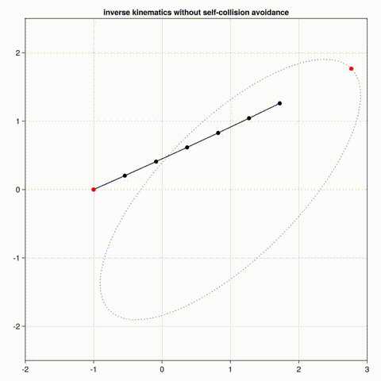
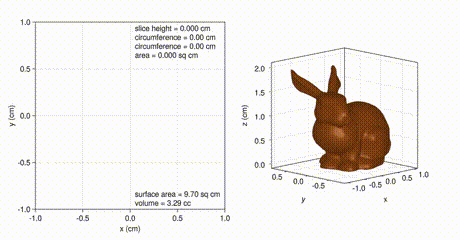
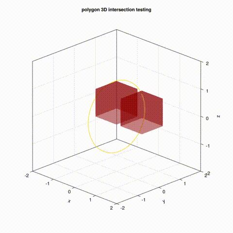
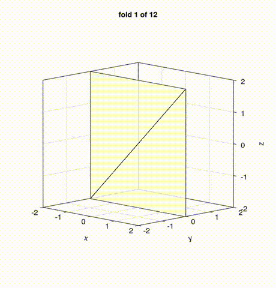

# ripga
# Reference Implementation of Projective Geometric Algebra

>"As long as Algebra and Geometry were separated, their progress was slow and their use limited;
>but once these sciences were united, they lent each other mutual support and advanced rapidly together
>towards perfection. We owe to Descartes the application of Algebra to Geometry; this has become the
>key to the greatest discoveries in all fields of mathematics." - Joseph-Louis Lagrange (1736–1813)

# 0. TLDR
Here's a showcase of animations from simple applications demonstrating [Julia](https://julialang.org),
[Makie](https://docs.makie.org/stable), and [Projective Geometric Algebra](https://bivector.net) as
implemented by ripga (i.e., the Reference Implementation of Projective Geometric Algebra). The intent
of the ripga library and this essay is to increase the familiarity with PGA so that more people are
able to design solutions to intricate geometry problems. The source code of the animations and the
ripga library, both written in Julia, is in the github repository at https://github.com/sepesi/ripga

<table>
  <tr>
    <td></td>
    <td></td>
  </tr>
  <tr>
    <td><b>Figure 0.1. <a href="https://enkimute.github.io/ganja.js/examples/coffeeshop.html#pga2d_inverse_kinematics">inverse kinematics</a> animation</b></td>
    <td><b>Figure 0.2. <a href="https://enkimute.github.io/ganja.js/examples/coffeeshop.html#pga3d_slicing">3D object slicing</a> animation</b></td>
  </tr>
  <tr>
    <td>Based upon Steven De Keninck's inverse kinematics example application in JavaScript and ported to Julia and Makie.</td>
    <td>Based upon Steven De Keninck's pga3d_slicing example application in JavaScript and ported to Julia and Makie.</td>
  </tr>
  <tr>
    <td></td>
    <td></td>
  </tr>
  <tr>
    <td><b>Figure 0.3. <a href="https://enkimute.github.io/ganja.js/examples/coffeeshop.html#pga2d_separating_axis">Separating Axis Theorem (SAT)</a> animation</b></td>
    <td><b>Figure 0.4. <a href="https://enkimute.github.io/ganja.js/examples/coffeeshop.html#pga2d_origami">origami</a> animation</b></td>
  </tr>
  <tr>
    <td>3D version of Separating Axis Theorem (SAT) implemented in Julia and Makie.</td>
    <td>Based upon Steven De Keninck's oeigami example application in JavaScript and ported to Julia and Makie.</td>
  </tr>
</table>

# 1. Why Projective Geometric Algebra?
For intricate geometry problems, there are several compelling reasons for using Projective Geometric Algebra:
* PGA unifies many concepts (e.g., translations and rotations), making them easier to implement,
* PGA has geometric objects (e.g., points, lines, planes), making them easier to mentally manipulate than matrices of coordinates, and
* PGA belongs to the family of [Cayley-Klein](https://en.wikipedia.org/wiki/Cayley%E2%80%93Klein_metric)
  geometries, unifying Euclidean geometry (with applications in computer graphics and simulating the
  dynamic motion of objects), elliptic geometry (with applications in cosmology and cartography),
  and hyperbolic geometry (with applications in spatial indexing data structures and relativistic spacetime
  modeling).

## 1.1 Unify Concepts
In Projective Geometric Algebra,
* translation and rotation are the same thing,
* force and torque are the same thing, and
* Maxwell's four equations can be written as one equation.

More concise implementations in software result in faster development, fewer bugs, and less technical debt. 
For example, [this video](https://www.youtube.com/watch?v=_3WPLawT-H0) shows Dr. Todd Ell, senior technical
fellow at Collins Aerospace (with 68,000 employees including 16,700 engineers, the world's largest supplier
of aerospace components) describing how he is pushing to train the highly regulated Collins Aerospace engineers
to use geometric algebra as a design and development tool, in many cases instead of the traditional linear
algebra tools.

## 1.2 Geometric Objects
Projective Geometric Algebra embeds coordinates in geometric objects, which are easier to debug than matrices
of coordinates. That abstraction is especially helpful when solving complex geometry problems.

## 1.3 Unify Geometries
The metric signature (i.e., $\mathbb{R}\_{positive,negative,zero}$, where the three subscripts denote how many
basis vectors square to +1, -1, and 0, respectively) denotes the geometry's dimensions and spatial curvature.
For example, the metric signatures $\mathbb{R}^\*\_{2,0,1}$ and $\mathbb{R}^\*\_{3,0,1}$ denote 2D and 3D
Euclidean spaces. However, switching the signature to $\mathbb{R}\_{4,0,0}$ denotes an elliptic space and
$\mathbb{R}\_{3,1,0}$ denotes a hyperbolic space.

# 2. Why Julia?
There are quite a few advantages in using Julia to implement Projective Geometric Algebra applications:
* advanced capabilities in vector operations (and vector operations play a central role in PGA),
* metaprogramming capabilities,
* program execution speed,
* plotting capabilities,
* REPL (Read Execute Print Loop), and
* developer community.

## 2.1 Advanced Capabilities in Vector Operations
Although [bivector.net](https://bivector.net) has reference implementations of PGA in several programming languages
(e.g., JavaScript, C++, C#, Python, Rust), it does not currently list a Julia reference implementation. Also, Julia is
necessarily missing from the book _[Geometric Algebra for Computer Science](https://www.amazon.com/s?k=geometric+algebra+for+computer+science&crid=2W6JCKEWE1CTO)_
given that the Julia language was created two years after the book's publication. To get a Julia implementation of PGA,
I ported bivector.net's C++ reference implementation of PGA to Julia. The github repository is at https://github.com/sepesi/ripga

To avoid confusion, ripga uses exactly the same [vector operator symbols](https://www.youtube.com/watch?v=2DgxeizE3E8&t=105s)
as the vector operators in the programming syntax of the original bivector.net reference implementation as shown in the table
below. The strikethrough of the dual operator math syntax entry denotes that the math syntax of the dual opertor is not currently
implemented due to a design decision valuing the improved code simplicity over the minor inconvenience of having to use programming
syntax for the dual operator. The dual operator had the most complex conversion from math syntax to programming syntax because the
dual operator in math syntax is the only postfix (i.e., a`*`) operator. All other operators in the following vector operator symvol
table are either prefix operators (e.g., !a) or infix operators (e.g., a ^ b) which are compatible with the prefix and infix operator
capabilities of Julia's  built-in [AST](https://en.wikipedia.org/wiki/Abstract_syntax_tree) parser.

| Math Syntax | Vector Operator Symbol Name | Programming Syntax |
| :--- | :--- | :--- |
| $`ab`$ | Geometric Product | `a * b` |
| $`a \wedge b`$ | Outer Product (Wedge) | `a ^ b` |
| $`a \vee b`$ | Regressive Product (Vee) | `a & b` |
| $`a \cdot b`$ | Inner Product (Dot) | `a` \| `b` |
| ~~`a*`~~ | Dual | `a!` |
| $`ab\tilde{a}`$ | Sandwich Product | `a >>> b` |

It should be noted that the general consensus from the Julia community is that my approach to overloading the
vector operators in ripga is "type piracy". The community suggested that I overload custom types instead of base
types in order to comply with the "avoid type piracy" rule in [Julia's style guide](https://docs.julialang.org/en/v1/manual/style-guide/).
Their concerns are that my approach of overloading base types might
* crash Julia,
* introduce incompatibilities that are hard to predict and diagnose,
* change the behavior of unrelated code unexpectedly, and
* make the code difficult to read.

However, I've been using ripga and its overloading of base types for several years and have not experienced any
of the Julia community's concerns. In my opinion, I think overloading the base types actually makes the code easier
to read. Of course, if someone dislikes my "type piracy" enough to fork the ripga repository and overload custom
types instead of base types, I'd love to see it and compare the two approaches. To me, the community's "type piracy"
label seems like an exaggeration because "piracy" implies stealing but my overloading of base types occurs only
when the arguments are vectors and those vector operations don't even compile without the base type overloading.
So, given that the vector operations are currently unused, perhaps a better name for my particular violation of
Julia's style guide would be "type squatting" instead of "type piracy"??

## 2.2 Metaprogramming Capabilities
Julia's extensive metaprogramming capabilities offer a convenient conversion from PGA "math syntax" to PGA "programming 
syntax". For example, referring to the above Vector Operator Symbol table, the geometric product operator in math
syntax [Unicode](https://en.wikipedia.org/wiki/Unicode) is '\thinspace' which takes less space than '*' (the geometric
product operator in programming syntax). Similarly,
* the wedge operator (outer product) in math syntax Unicode is '\wedge',
* the vee operator (regressive product) in math syntax Unicode is '\vee', and
* the dot operator (inner product) in math syntax Unicode is '\cdot'.

The string macro called ga (short for Geometric Algebra and coded in ripgand.jl) translates the math syntax back to
the programming syntax. Typically, I prefer the programming syntax because it is easier to type. However, the math
syntax is easier to read. Therefore, for a section of code with a lot of PGA vector operators that are hard to read,
the ga macro can be helpful.

## 2.3 Program Execution Speed
As mentioned in the official _[Introduction to Julia](https://julialang.org): A Fresh Approach to Numerical Computing_,
the authors (i.e., the four people who started the Julia programming language) mention a long standing belief among many
practitioners of numerical computing: one must prototype in one language for development speed but then rewrite in another
language for execution speed. One of the Julia design goals was to solve this two-language problem by making Julia both
fast for prototyping and execution.

## 2.4 Plotting Capabilities
According to the official [introduction to Makie](https://docs.makie.org/stable/),
> "Makie is a data visualization ecosystem for the Julia programming language, with high performance and extensibility.
> It is available for Windows, Mac and Linux."

The Makie backend package is GLMakie which is based upon OpenGL and is surprisingly fast.

## 2.5 REPL (Read Execute Print Loop)
In the [tools section](https://bivector.net/tools.html?p=3&q=0&r=1) of bivector.net, there is a PGA expression evaluator
for exploring PGA expressions. After including the ripga files, Julia's REPL can similarly explore PGA expressions. However,
in addition to evaluating PGA expressions, Julia's REPL (after including ripgand.jl and ripga1d.jl, ripga2d.jl, ripga3d.jl,
or ripga4d.jl) can do several things that the bivector.net PGA expression evaluator cannot. Specifically, Julia's REPL helps
by being capable of
* assigning PGA expressions to variables,
* calling functions, and
* displaying inline comments.

## 2.6 Developer Community
In the conclusion of _[Julia: A Fresh Approach to Numerical Computing](https://julialang.org/assets/research/julia-fresh-approach-BEKS.pdf)_,
the authors write
> "We built Julia to meet our needs for numerical computing, and it turns out that many others wanted exactly the same thing. 
> At the time of writing, not a day goes by when we don't learn that someone new has picked up Julia at universities and
> companies around the world, in fields as diverse as engineering, mathematics, physical and social sciences, finance, biotech,
> and many others. More than just a language, Julia has become a place for programmers, physical scientists, social scientists,
> computational scientists, mathematicians, and others to pool their collective knowledge in the form of online discussions and code."

The significant overlap of the many fields interested in Julia and the many fields interested in geometric algebras (e.g., Projective 
Geometric Algebra, spacetime geometric algebra, conformal geometric algebra) suggests that the Julia community and the Geometric Algebra
community would benefit from each other.

# 3. Getting the Hang of PGA
There are three perspectives that contribute to understanding PGA:

## 3.1 History
Reading a description of the historical contributions to the development of PGA by individual mathematicians builds confidence in the
underlying concepts. I particularly like [Slehar's historical description of Clifford algebra](https://slehar.wordpress.com/2014/03/18/clifford-algebra-a-visual-introduction/)
followed by [Slehar's explanation of how Clifford algebra extends to Projective Geometry](https://slehar.wordpress.com/2014/06/26/geometric-algebra-projective-geometry/).

## 3.2 Nomenclature
In PGA, simple geometric objects (e.g., points, lines, planes) are written as PGA expressions. Those geometric objects are manipulated
(e.g., translated or rotated) by performing PGA operations (e.g., geometric product or outer product) on them. PGA expressions are
[linear combinations](https://en.wikipedia.org/wiki/Linear_combination) of PGA basis vectors. There is one PGA basis vector for each
perpendicular axis in the underlying space, which is defined by the [metric signature](https://en.wikipedia.org/wiki/Metric_signature)
typically written as $\mathbb{R}\_{positive,negative,zero}$, where the signature's three subscripts are the number of PGA basis vectors that
square to +1, -1, and 0, respectively. For example, the metric signature for doing PGA in an n-dimensional [Euclidean space](https://en.wikipedia.org/wiki/Euclidean_space)
is $\mathbb{R}^\*\_{n,0,1}$, where n is the number of Euclidean dimensions (which is also the number of Euclidean basis vectors in the PGA basis)
and the 1 as the last of the three subscripts denotes the single ideal basis vector that squares to 0. That ideal basis vector is also known as the
null basis vector e0. The n Euclidean basis vectors in an n-dimvensional Euclidean space $\mathbb{R}^\*\_{n,0,1}$ are called e1, e2, ..., en.

In addition to the rules in the metric signature defining how the PGA basis vectors square, there is one more important rule:
[the contraction axiom](https://www.youtube.com/watch/v=tX4H_ctggYo&t=3293s) that defines how the sign changes with the order of
PGA basis vectors in the geometric product. For example, ei\*ej = -ej\*ei. As a notational convenience, the geometric operator is often implied (e.g.,
ei\*ej = eiej) and as a further convenience the subsequent e's after the first are also implied (e.g., eiej = eij).

The n Euclidean basis vectors and the one ideal basis vector are said to have grade-1 because they are generated from a single PGA basis vector (e.g., e2).
The PGA basis also contains elements of grades other than grade-1. Grade-n elements of the PGA basis are generated from n PGA basis vectors. For example,
grade-2 elements in the PGA basis are called bivectors (e.g., e12 = e1e2) and grade-3 elements in the PGA basis are called trivectors (e.g., e012 = e0e1e2).
Because each PGA basis element can be represesnted by a vector, a PGA basis can be thought of as a vector of vectors. However, to avoid ambiguity about
the meaning of "vector", the phrase "PGA basis vector" in this essay will be reserved for just the grade-1 PGA basis elements and the phrases "PGA basis
bivector" and "PGA basis trivector" will be reserved for grade-2 and grade-3 PGA basis elements, respectively. Arbitrary grade PGA basis elements of an
arbitrary grade are just called "PGA basis elements". (More on the PGA basis elements in the next section of this essay.)

For the metric signature $\mathbb{R}^\*\_{n,0,1}$, there are a total of $2^{n+1}$ PGA basis elements according to the [rule of product](https://wikipedia.org/wiki/Rule_of_product).
Those $2^{n+1}$ PGA basis elements are diswtributed across n+2 grades (i.e., grade-0 through grade n+1), each with $\binom{n+1}{grade}$ PGA basis elements per grade, according to
[Pascal's triangle](https://wikipedia.org/wiki/Pascal's_triangle) from [combinatorics](https://en.wikipedia.org/wiki/Combinatorics). For example in 3D PGA, there are a total of
16 (i.e., $2^{3+1}$) PGA basis elements: 
* 1 grade-0 (i.e., the scalar),
* 4 grade-1 (i,e., e0, e1, e2, e3),
* 6 grade-2 (i.e., e01, e02, e03, e12, e31, e23),
* 4 grade-3 (i.e., e021, e013, e032, e123), and
* 1 grade-4 (i.e., e0123).

## 3.3 Geometric Interpretation
Recalling that the three subscripts of the metric signature $\mathbb{R}\_{positive,negative,zero}$ specify how many PGA basis vectors square to +1,
-1, and 0, respectively, you may have noticed that the metric signature for PGA in an n-dimensional Euclidean space (i.e., $\mathbb{R}^\*\_{n,0,1}$)
has an asterisk. The asterisk specifies the geometric interpretation of the PGA basis:
* with the asterisk, the geometric interpretation is "plane-based", and
* without the asterisk the geometric interpretation is "point-based".

For most people familiar with linear algebra, the geometric interpretation is the most confusing of the three perspectives needed to fully appreciate
PGA. Because plane-based PGA offers several advantages (e.g., universal rotors) over point-based PGA, plane-based PGA is used much more often than
point-based PGA. If the plane-based/point-based qualifier is missing, it is usually safe to assume the intent was plane-based PGA.

In 3D plane-based PGA,
* a grade-1 PGA basis element (e.g., e1) represents a plane,
* a grade-2 PGA basis element (e.g., e12) represents a line, and
* a grade-3 PGA basis element (e.g., e123) represents a point.

In contrast, in 3D point-based PGA,
* a grade-1 PGA basis element (e.g., e1) represents a point,
* a grade-2 PGA basis element (e.g., e12) represents a line, and
* a grade-3 PGA basis element (e.g., e123) represents a plane.

(More on the geometric interpretations in the next section.)

# 4. PGA Basis
The ripga library is capable of switching back and forth between the bases for 1D PGA, 2D PGA, 3D PGA, and 4D PGA.

## 4.1 1D PGA Basis
To prepare Julia's REPL for 1D PGA, include the files ripgand.jl and ripga1d.jl. To confirm the initialization, print out the basis.

```
julia> include("ripgand.jl"); # utility functions for all available dimensions

julia> include("ripga1d.jl"); # enable 1D PGA

julia> basis
4×2 Matrix{String}:
 "1"    "# scalar (specified as eu in vector form)"
 "e0"   "# ideal point (the point at infinity)"
 "e1"   "# Euclidean point at origin (x=0)"
 "e01"  "# pseudoscalar (the entire 1D space)"
```
In 1D PGA, there are a total of four (i.e., $2^{1+1}$) PGA basis elements:
* 1 grade-0 (i.e., the scalar),
* 2 grade-1 (i,e., e0, e1), and
* 1 grade-2 (i.e., e01).

Listing the 1D PGA basis element names in a row vector results in the vector of vectors form of the 1D PGA basis. Note that the REPL
shows column vectors of length five instead of four because ripga appends to each PGA basis element a status field (which is
currently unused).
```
julia> B = [eu e0 e1 e01] # 1D PGA basis in form of vector of vectors
5×4 Matrix{Float32}:
 1.0  0.0  0.0  0.0
 0.0  1.0  0.0  0.0
 0.0  0.0  1.0  0.0
 0.0  0.0  0.0  1.0
 0.0  0.0  0.0  0.0
```
Calling the PGA basis "B" and calling the PGA basis reversed left to right "BR", B and BR can be used as inputs to geoprodset() to
calculate the needed sign changes in the dual operation (omitting the appended status field in each PGA basis element). Applying
those sign changes to the reverse(basis) converts it to the dual of the basis, as shown in the following REPL.
```
julia> BR = [e01 e1 e0 eu]; # B in Reverse (right to left)

julia> P = geoprodset(B[1:end-1,:],BR[1:end-1,:])[end,:]; # Pseudoscalar row of geoprodset() result

julia> S = [p < 0 ? "-" : "" for p in P] # Sign changes needed for dual operation
4-element Vector{String}:
 ""
 ""
 "-"
 ""

julia> HDR = ["PGA BASIS"  "DUAL PGA BASIS"; "" ""] # header
2×2 Matrix{String}:
 "PGA BASIS"  "DUAL PGA BASIS"
 ""           ""

julia> [HDR; [basis[:,1]  S.*reverse(basis[:,1])]]
6×2 Matrix{String}:
 "PGA BASIS"  "DUAL PGA BASIS"
 ""           ""
 "1"          "e01"
 "e0"         "e1"
 "e1"         "-e0"
 "e01"        "1"
```
According to the [Cartan–Dieudonné theorem](https://en.wikipedia.org/wiki/Cartan%E2%80%93Dieudonn%C3%A9_theorem), every
rigid body transformation is composed of reflections across hyperplanes (i.e., points in 1D, lines in 2D, planes in 3D).
In 1D, a translation is two reflections across two points, as shown in the following REPL session where 
* P1 is a point at x=1,
* P2 is a point at x=6, and
* the motor composed of those two points separated by a distance of 5 translates a point to the right by 10 (i.e., twice
  the separation distance between the two points).

```
julia> P1 = e1 + e0; # Euclidean point x=1 => 1D PGA point (xe0+e1)

julia> P2 = e1 + 6*e0; # Euclidean point x=6 => 1D PGA point (xe0+e1)
on motor as geometric product

julia> 
julia> T = P2*P1; # compose the two reflection TranslatitoStr(T) # check Translation motor (distance between reflection points is 5)
"1 + 5e01"

julia> P0 = e1; # Euclidean origin (x=0 => 1D PGA point (xe0+e1)

julia> PX = T*P0*~T; # apply Translation motor to P0 at origin; alternative eq is PX = T>>>P0

julia> toStr(PX) # resulting dual PGA point (xe0+e1) => Euclidean point x=10
"10e0 + e1"
```
Taking a closer look, the reason that the translation motor in the above REPL session works is because the sandwich
operation is an [orthogonal transformation](https://en.wikipedia.org/wiki/Orthogonal_transformtion) (i.e., the squared
norm of the 1D PGA object is preserved through translation T). Concretely, the squared norm of P0 is e11 = 1 and so is
the squared norm of T*P0*~T = 1 because T*P0*~T = e1 + 10e0 and (e1 + 10e0)(e1 + 10e0) = e11 + 10e01 - 10e01 + 100e00 = 1
because e11 = 1 and e00 = 0. In other words, the squared norm of the 1D PGA point P0 is preserved through the sandwich
operation.

In contrast to that translation using the **plane-based** geometric interpretation of PGA basis elements, an attempt
to do a similar translation using the **point-based** geometric interpretation does not work:
```
julia> P1 = e0 + e1; # point-based 1D PGA point at x=1

julia> P2 = e0 + 6*e1; # point-based 1D PGA point at x=6

julia> T = P2*P1; # attempt at calculating point-based 1D PGA translation motor

julia> toStr(T)
"6 - 5e01"
```
Recall that the plane-based 1D PGA translation motor was T = 1 + 5e01, which is the exact algebraic form of a 
[dual number](https://en.wikipedia.org/wiki/Dual_number). In contrast, when using the **point-based** geometric
Interpretation, the translation motor is T = 6 - 5e01, which is **not** in the algebraic form of a dual number.
That is a red flag, but let's naively continue with the sandwich operation.
```
julia> P0 = e0; # point-based 1D PGA point of Euclidean origin

julia> PX = T*P0*~T; # naive sandwich operation calculating translated point-based 1D PGA point

julia> toStr(PX)
"36e0"
```
That calculated PX is not in the form of a translated point (i.e., PX = e0 + xe1). Therefore, that attempt at
using a **point-based** geometric interpretation with a 1D PGA translation motor failed. Looking closer for the
cause of the failure, the squared norm of P0 was preserved through the sandwich operation but only in the trivial
sense because the squared norm of P0 collapsed to zero (i.e., e00 = 0) and the squared norm of PX also collapsed
to zero (i.e., 36*36e00 = 0).

## 4.2 2D PGA Basis
To prepare Julia's REPL for 2D PGA, include the files ripgand.jl and ripga2d.jl. To confirm the initialization, print out the basis.

```
julia> include("ripgand.jl"); # utility functions for all available dimensions

julia> include("ripga2d.jl"); # enable 2D PGA

julia> basis
8×2 Matrix{String}:
 "1"     "# scalar (specified as eu in vector form)"
 "e0"    "# ideal line (line at infinity, encloses the 2D space)"
 "e1"    "# y-axis line (i.e., the x=0 line)"
 "e2"    "# x-axis line (i.e., the y=0 line)"
 "e01"   "# ideal point in y-direction"
 "e20"   "# ideal point in x-direction"
 "e12"   "# Euclidean point at origin (x=0,y=0)"
 "e012"  "# pseudoscalar (the entire 2D space)"
```
In 2D PGA, there are a total of eight (i.e., $2^{2+1}$) PGA basis elements:
* 1 grade-0 (i.e., the scalar),
* 3 grade-1 (i,e., e0, e1, e2),
* 3 grade-2 (i.e., e01, e20, e12), and
* 1 grade-3 (i.e., e012).

Listing the 2D PGA basis element names in a row vector results in the vector of vectors form of the 2D PGA basis. Note that the REPL
shows column vectors of length nine instead of eight because ripga appends to each PGA basis element a status field (which is
currently unused).
```
julia> B = [eu e0 e1 e2 e01 e20 e12 e012]  # 2D PGA basis in form of vector of vectors
9×8 Matrix{Float32}:
 1.0  0.0  0.0  0.0  0.0  0.0  0.0  0.0
 0.0  1.0  0.0  0.0  0.0  0.0  0.0  0.0
 0.0  0.0  1.0  0.0  0.0  0.0  0.0  0.0
 0.0  0.0  0.0  1.0  0.0  0.0  0.0  0.0
 0.0  0.0  0.0  0.0  1.0  0.0  0.0  0.0
 0.0  0.0  0.0  0.0  0.0  1.0  0.0  0.0
 0.0  0.0  0.0  0.0  0.0  0.0  1.0  0.0
 0.0  0.0  0.0  0.0  0.0  0.0  0.0  1.0
 0.0  0.0  0.0  0.0  0.0  0.0  0.0  0.0
```
Calling the PGA basis "B" and calling the PGA basis reversed left to right "BR", B and BR can be used as inputs to geoprodset() to
calculate the needed sign changes in the dual operation (omitting the appended status field in each PGA basis element).
```
ulia> BR = [e012 e12 e20 e01 e2 e1 e0 eu] # B in Reverse order (i.e., right to left)
9×8 Matrix{Float32}:
 0.0  0.0  0.0  0.0  0.0  0.0  0.0  1.0
 0.0  0.0  0.0  0.0  0.0  0.0  1.0  0.0
 0.0  0.0  0.0  0.0  0.0  1.0  0.0  0.0
 0.0  0.0  0.0  0.0  1.0  0.0  0.0  0.0
 0.0  0.0  0.0  1.0  0.0  0.0  0.0  0.0
 0.0  0.0  1.0  0.0  0.0  0.0  0.0  0.0
 0.0  1.0  0.0  0.0  0.0  0.0  0.0  0.0
 1.0  0.0  0.0  0.0  0.0  0.0  0.0  0.0
 0.0  0.0  0.0  0.0  0.0  0.0  0.0  0.0

julia> geoprodset(B[1:end-1,:],BR[1:end-1,:])[end,:]
8-element Vector{Float32}:
 1.0
 1.0
 1.0
 1.0
 1.0
 1.0
 1.0
 1.0
```
Applying those sign changes to the reverse(basis) converts it to the dual of the basis.

According to the [Cartan–Dieudonné theorem](https://en.wikipedia.org/wiki/Cartan%E2%80%93Dieudonn%C3%A9_theorem), every
rigid body transformation is composed of reflections across hyperplanes (i.e., points in 1D, lines in 2D, planes in 3D).
In 2D, a translation is two reflections across parallel lines and a rotation is two reflections across intersecting lines,
as shown in the following REPL where
* L1 is a vertical line, the y-axis,
* L2 is another vertical line, 5 to the right of the y-axis, and
* the motor composed of those two parallel vertical lines separated by a distance of 5 translates a point to the right by 10
  (i.e., twice the distance between the two parallel lines).

```
julia> L1 = e1; # the x=0 hyperplane is the y-axis

julia> L2 = e1-5*e0; # Euclidean x-d=0 => dual PGA line (ae1+be2+ce0); see cheat sheet

julia> T = L2*L1; # compose the two reflection Translation motor as geometric product

julia> toStr(T) # check Translation motor
"1 - 5e01"

julia> P = e12; # Euclidean origin => dual PGA point (xe20+ye01+e12); see cheat sheet

julia> P2 = T*P*~T; # apply Translation motor to P at origin; alternative eq is P2 = T>>>P

julia> toStr(P2) # resulting dual PGA point (xe20+ye01+e12) => Euclidean point (x,y) = (10,0); see cheat sheet
"10e20 + e12"
```
Taking a closer look, the reason that the above translation motor works is because the sandwich
operation is an [orthogonal transformation](https://en.wikipedia.org/wiki/Orthogonal_transformtion) (i.e., the squared
norm of the 2D PGA object is preserved through translation T). Concretely, the squared norm of P is e1212 = -1 and so is
the squared norm of T*P0*~T = -1 because T*P*~T = (1 - 5e01)e12(1 - 5e10) = e12 - 5 e1210 - 5e02 + 25e0210 = e12 and
(T*P*~T)*(T*P*~T) = e1212 = -1. In other words, the squared norm of the 2D PGA point P is preserved through the sandwich
operation.

In contrast to that translation using the **plane-based** geometric interpretation of PGA basis elements, an attempt
to make a translation motor using the **point-based** geometric interpretation fails where
* L1 is still the y-axis but has the 2D **point-based** PGA expression e0^e2 = -e20,
* L2 is still 5 to right of L1 but has the 2D **point-based** PGA expression e0^e2+5e1^e2 = -e20+5e12, and
* the attempt to make a translation motor T = L2*L1 fails because L2*L1 = (-e20+5e12)*(-e20) = 5e01 which is not in the
  correct form (i.e., is not a dual number) to be a translation motor.
```
julia> L1 = -e20; # Line 1 in 2D point-based PGA

julia> L2 = -e20 + 5*e12; # Line 2 in 2D point-based PGA

julia> T = L2*L1; # failed attempt to calculate point-based Translation motor

julia> toStr(T) # failed because not in form of dual number, missing scalar term
"5e01"
```
## 4.3 3D PGA basis
To prepare Julia's REPL for 2D PGA, include the files ripgand.jl and ripga2d.jl. To confirm the initialization, print out the basis.

```
julia> include("ripgand.jl"); # utility functions for all available dimensions

julia> include("ripga3d.jl"); # enable 3D PGA

julia> basis
16×2 Matrix{String}:
 "1"      "# scalar (specified as eu in vector form)"
 "e0"     "# ideal plane (the plane at infinity)"
 "e1"     "# Euclidean yz-plane (i.e., the x=0 plane)"
 "e2"     "# Euclidean zx-plane (i.e., the y=0 plane)"
 "e3"     "# Euclidean xy-plane (i.e., the z=0 plane)"
 "e01"    "# ideal line x (i.e., in yz-plane, the line at infinity)"
 "e02"    "# ideal line y (i.e., in zx-plane, the line at infinity)"
 "e03"    "# ideal line z (i.e., in xy-plane, the line at infinity)"
 "e12"    "# z-axis line"
 "e31"    "# y-axis line"
 "e23"    "# x-axis line"
 "e021"   "# ideal point z (i.e., the point at infinity along z-axis)"
 "e013"   "# ideal point y (i.e., the point at infinity along y-axis)"
 "e032"   "# ideal point x (i.e., the point at infinity along x-axis)"
 "e123"   "# Euclidean point at origin (x=0,y=0,z=0)"
 "e0123"  "# pseudoscalar (the entire 3D space)"
```
In 3D PGA, there are a total of 16 (i.e., $2^{3+1}$) PGA basis elements:
* 1 grade-0 (i.e., the scalar),
* 4 grade-1 (i,e., e0, e1, e2, e3),
* 6 grade-2 (i.e., e01, e02, e03, e12, e31, e23),
* 4 grade-3 (i.e., e021, e013, e032, e123), and
* 1 grade-4 (i.e., e0123).

Listing the 3D PGA basis element names in a row vector results in the vector of vectors form of the 3D PGA basis. Note that the REPL
shows column vectors of length 17 instead of 16 because ripga appends to each PGA basis element a status field (which is
currently unused).
```
julia> B = [eu e0 e1 e2 e3 e01 e02 e03 e12 e31 e23 e021 e013 e032 e123 e0123]
17×16 Matrix{Float32}:
 1.0  0.0  0.0  0.0  0.0  0.0  0.0  0.0  0.0  0.0  0.0  0.0  0.0  0.0  0.0  0.0
 0.0  1.0  0.0  0.0  0.0  0.0  0.0  0.0  0.0  0.0  0.0  0.0  0.0  0.0  0.0  0.0
 0.0  0.0  1.0  0.0  0.0  0.0  0.0  0.0  0.0  0.0  0.0  0.0  0.0  0.0  0.0  0.0
 0.0  0.0  0.0  1.0  0.0  0.0  0.0  0.0  0.0  0.0  0.0  0.0  0.0  0.0  0.0  0.0
 0.0  0.0  0.0  0.0  1.0  0.0  0.0  0.0  0.0  0.0  0.0  0.0  0.0  0.0  0.0  0.0
 0.0  0.0  0.0  0.0  0.0  1.0  0.0  0.0  0.0  0.0  0.0  0.0  0.0  0.0  0.0  0.0
 0.0  0.0  0.0  0.0  0.0  0.0  1.0  0.0  0.0  0.0  0.0  0.0  0.0  0.0  0.0  0.0
 0.0  0.0  0.0  0.0  0.0  0.0  0.0  1.0  0.0  0.0  0.0  0.0  0.0  0.0  0.0  0.0
 0.0  0.0  0.0  0.0  0.0  0.0  0.0  0.0  1.0  0.0  0.0  0.0  0.0  0.0  0.0  0.0
 0.0  0.0  0.0  0.0  0.0  0.0  0.0  0.0  0.0  1.0  0.0  0.0  0.0  0.0  0.0  0.0
 0.0  0.0  0.0  0.0  0.0  0.0  0.0  0.0  0.0  0.0  1.0  0.0  0.0  0.0  0.0  0.0
 0.0  0.0  0.0  0.0  0.0  0.0  0.0  0.0  0.0  0.0  0.0  1.0  0.0  0.0  0.0  0.0
 0.0  0.0  0.0  0.0  0.0  0.0  0.0  0.0  0.0  0.0  0.0  0.0  1.0  0.0  0.0  0.0
 0.0  0.0  0.0  0.0  0.0  0.0  0.0  0.0  0.0  0.0  0.0  0.0  0.0  1.0  0.0  0.0
 0.0  0.0  0.0  0.0  0.0  0.0  0.0  0.0  0.0  0.0  0.0  0.0  0.0  0.0  1.0  0.0
 0.0  0.0  0.0  0.0  0.0  0.0  0.0  0.0  0.0  0.0  0.0  0.0  0.0  0.0  0.0  1.0
 0.0  0.0  0.0  0.0  0.0  0.0  0.0  0.0  0.0  0.0  0.0  0.0  0.0  0.0  0.0  0.0

julia> BR = [e0123 e123 e032 e013 e021 e23 e31 e12 e03 e02 e01 e3 e2 e1 e0 eu]
17×16 Matrix{Float32}:
 0.0  0.0  0.0  0.0  0.0  0.0  0.0  0.0  0.0  0.0  0.0  0.0  0.0  0.0  0.0  1.0
 0.0  0.0  0.0  0.0  0.0  0.0  0.0  0.0  0.0  0.0  0.0  0.0  0.0  0.0  1.0  0.0
 0.0  0.0  0.0  0.0  0.0  0.0  0.0  0.0  0.0  0.0  0.0  0.0  0.0  1.0  0.0  0.0
 0.0  0.0  0.0  0.0  0.0  0.0  0.0  0.0  0.0  0.0  0.0  0.0  1.0  0.0  0.0  0.0
 0.0  0.0  0.0  0.0  0.0  0.0  0.0  0.0  0.0  0.0  0.0  1.0  0.0  0.0  0.0  0.0
 0.0  0.0  0.0  0.0  0.0  0.0  0.0  0.0  0.0  0.0  1.0  0.0  0.0  0.0  0.0  0.0
 0.0  0.0  0.0  0.0  0.0  0.0  0.0  0.0  0.0  1.0  0.0  0.0  0.0  0.0  0.0  0.0
 0.0  0.0  0.0  0.0  0.0  0.0  0.0  0.0  1.0  0.0  0.0  0.0  0.0  0.0  0.0  0.0
 0.0  0.0  0.0  0.0  0.0  0.0  0.0  1.0  0.0  0.0  0.0  0.0  0.0  0.0  0.0  0.0
 0.0  0.0  0.0  0.0  0.0  0.0  1.0  0.0  0.0  0.0  0.0  0.0  0.0  0.0  0.0  0.0
 0.0  0.0  0.0  0.0  0.0  1.0  0.0  0.0  0.0  0.0  0.0  0.0  0.0  0.0  0.0  0.0
 0.0  0.0  0.0  0.0  1.0  0.0  0.0  0.0  0.0  0.0  0.0  0.0  0.0  0.0  0.0  0.0
 0.0  0.0  0.0  1.0  0.0  0.0  0.0  0.0  0.0  0.0  0.0  0.0  0.0  0.0  0.0  0.0
 0.0  0.0  1.0  0.0  0.0  0.0  0.0  0.0  0.0  0.0  0.0  0.0  0.0  0.0  0.0  0.0
 0.0  1.0  0.0  0.0  0.0  0.0  0.0  0.0  0.0  0.0  0.0  0.0  0.0  0.0  0.0  0.0
 1.0  0.0  0.0  0.0  0.0  0.0  0.0  0.0  0.0  0.0  0.0  0.0  0.0  0.0  0.0  0.0
 0.0  0.0  0.0  0.0  0.0  0.0  0.0  0.0  0.0  0.0  0.0  0.0  0.0  0.0  0.0  0.0
```
Calling the PGA basis "B" and calling the PGA basis reversed left to right "BR", B and BR can be used as inputs to geoprodset() to
calculate the needed sign changes in the dual operation (omitting the appended status field in each PGA basis element).
```
julia> geoprodset(B[1:end-1,:],BR[1:end-1,:])[end,:]
16-element Vector{Float32}:
  1.0
  1.0
  1.0
  1.0
  1.0
  1.0
  1.0
  1.0
  1.0
  1.0
  1.0
 -1.0
 -1.0
 -1.0
 -1.0
  1.0
```
Applying those sign changes to the reverse(basis) converts it to the dual of the basis.

According to the [Cartan–Dieudonné theorem](https://en.wikipedia.org/wiki/Cartan%E2%80%93Dieudonn%C3%A9_theorem), every
rigid body transformation is composed of reflections across hyperplanes (i.e., points in 1D, lines in 2D, planes in 3D).
In 3D, a translation is two reflections across parallel planes and a rotation is two reflections across intersecting planes,
as shown in the following REPL where
* p1 is the x=0 plane,
* p2 is the x=5 plane, and
* the motor composed of those two parallel planes separated by a distance of 5 translates a point at P1=(-1,0,0) to P2=(9,0,0),
  a translation of 10 (i.e., twice the distance between the two parallel planes).
```
julia> p1 = e1; # x = 0 plane

julia> p2 = e1 - 5*e0; # x = 5 plane

julia> T = p2*p1; # Translation motor

julia> P1 = point(-1,0,0); # starting point

julia> P2 = T*P1*~T; # ending point, after translation T

julia> toStr(P2)
"9e032 + e123"

julia> toCoord(P2)
3-element Vector{Float32}:
 9.0
 0.0
 0.0
```


(TODO)


# 5. PGA Exponentials
At the risk of being too ee-sy (pun intended), the letter e is used in several ways:
* the name of the exponential function is e (e.g., e(10,X)),
* the first letter of each of the names of the hypercomplex vectors in the basis is e (e.g., e12), and
* the floating point format of numbers specified in scientific notation uses the letter e (e.g., 1e10).

An exponential function can demonstrate PGA's unification of translation and rotation.

(TODO)

$$
\mathbf{T} = \underbrace{ e^{\frac{\theta_1}{2}\mathbf{e}_{12}} e^{\frac{r_1}{2}\mathbf{e}_{01}} }_{\text{Circle 2}} \underbrace{ e^{\frac{\theta_2}{2}\mathbf{e}_{31}} e^{\frac{r_2}{2}\mathbf{e}_{03}} }_{\text{Circle 1}} \underbrace{\mathbf{e}_{123}}_{\text{origin}}
$$
